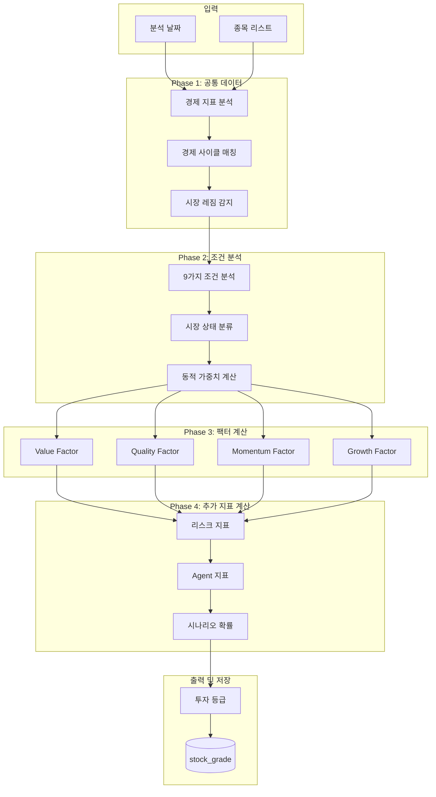
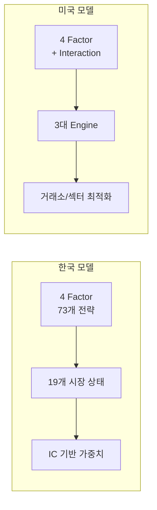
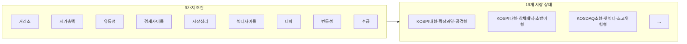
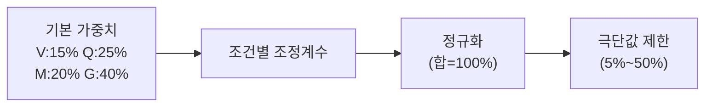
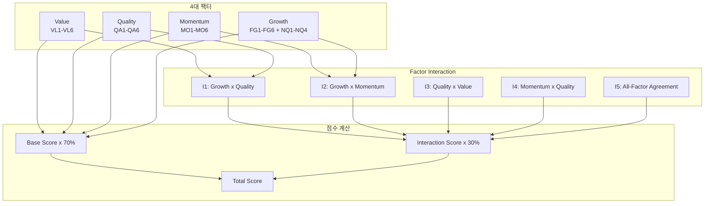
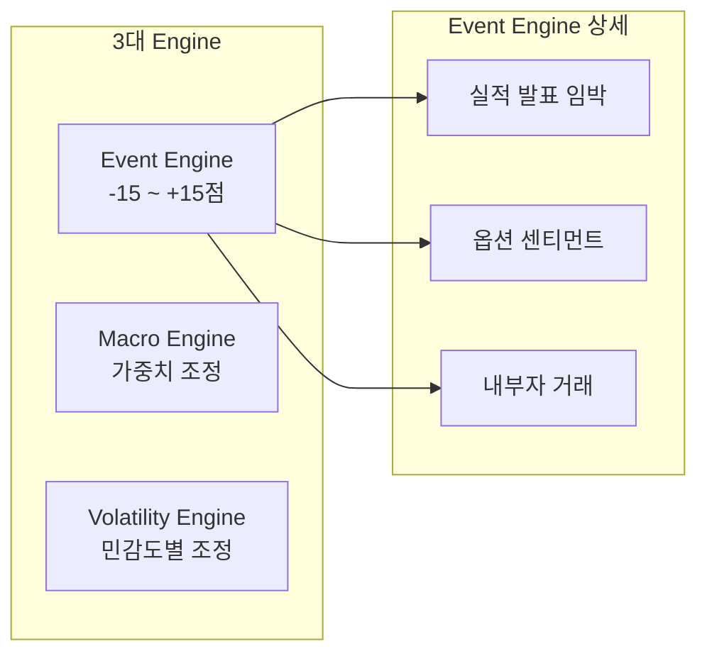

# 떡상 - Quant Engine(www.dducksang.com)


시나리오 기반 주식 투자 전략 서비스 "떡상"의 **멀티팩터 퀀트 분석 엔진**입니다.

---

## 목차

- [이 저장소의 역할](#이-저장소의-역할)
- [프로젝트 구조](#프로젝트-구조)
- [시스템 아키텍처](#시스템-아키텍처)
- [한국 퀀트 모델](#한국-퀀트-모델)
- [미국 퀀트 모델](#미국-퀀트-모델)
- [예측 적중률 추적 시스템](#예측-적중률-추적-시스템)
- [핵심 기술 특징](#핵심-기술-특징)
- [성능 특성](#성능-특성)
- [내부 디렉토리 구조](#내부-디렉토리-구조)
- [개발환경 및 사용기술](#개발환경-및-사용기술)
- [API 엔드포인트](#api-엔드포인트)
- [서비스 연동 (Chaining)](#서비스-연동-chaining)
- [License](#license)

---

## 이 저장소의 역할

전체 프로젝트 중 **Quant Engine** 컴포넌트를 담당합니다.

- 한국/미국 주식 약 7,000+ 종목 일괄 분석
- 4대 팩터 기반 투자 등급 산출 (A+ ~ F)
- IC(Information Coefficient) 기반 동적 가중치 시스템
- AI Agent용 트레이딩 지표 생성
- **Railway HTTP 서비스로 배포** (FastAPI + uvicorn)

## KR, US의 각 팩터별 전략 코드는 제외된 버전입니다.

## 프로젝트 구조

| 저장소 | 설명 | 기술 스택 |
|--------|------|-----------|
| [**overview**](https://github.com/vinjung/alphafolio_overview) | 프로젝트 설명 | - |
| [**client**](https://github.com/vinjung/alphafolio_client) | Frontend (UI/UX) (현재 저장소)  | Next.js 15, React 19, Tailwind CSS 4, Redis |
| [**api**](https://github.com/vinjung/alphafolio_api) | AI 채팅 백엔드 API (현재 저장소) | FastAPI, LangGraph, ChromaDB, Fine-tuned GPT |
| [**data**](https://github.com/vinjung/alphafolio_data) | 데이터 자동 수집 & 지표 계산 | FastAPI, asyncpg, Cloud Scheduler |
| [**chat**](https://github.com/vinjung/alphafolio_chat) | AI 비서 개발환경 | LangChain, LangGraph, ChromaDB |
| [**quant**](https://github.com/vinjung/alphafolio_quant) | **📍 멀티팩터 퀀트 분석 엔진 (현재 저장소)** | NumPy, SciPy, hmmlearn |
| [**stock_agent**](https://github.com/vinjung/alphafolio_stock_agent) | 종목 투자 전략 Multi-Agent AI | LangGraph, Task-driven Architecture |
| [**portfolio**](https://github.com/vinjung/alphafolio_portfolio) | 포트폴리오 생성 & 리밸런싱 엔진 | Risk Parity, VaR/CVaR, LangGraph |

---

## 시스템 아키텍처

### 전체 분석 파이프라인



### 한국 vs 미국 모델 비교



---

## 한국 퀀트 모델

### 4대 팩터 (73개 전략)

| 팩터 | 전략 수 | 주요 전략 |
|------|---------|-----------|
| **Value** | 15개 | Magic Formula, EV/EBITDA, 순자산할인, 주주환원율 |
| **Quality** | 17개 | ROE 일관성, 영업마진, 이자보상배율, 현금흐름 |
| **Momentum** | 23개 | 가격 모멘텀, RSI, MACD, 외국인 순매수 |
| **Growth** | 18개 | 매출/EPS/영업이익 성장률, R&D 투자 |

**특징**: 섹터 멀티플라이어 (0.5~1.5) 적용

### 19개 시장 상태 분류

9가지 조건을 분석하여 19개 시장 상태 중 하나로 분류:



| 그룹 | 상태 예시 | 특징 |
|------|----------|------|
| 대형주 (6개) | KOSPI대형-확장과열-공격형 | MEGA/LARGE, EXPANSION |
| 중형주 (6개) | KOSPI중형-확장과열-모멘텀형 | MEDIUM |
| 소형주 (4개) | KOSDAQ소형-핫섹터-초고위험형 | SMALL, HOT |
| 특수 (2개) | 전시장-극저유동성-고위험형 | PANIC, LOW liquidity |

### IC 기반 동적 가중치



| 팩터 | 기본 가중치 |
|------|------------|
| Growth | 40% |
| Quality | 25% |
| Momentum | 20% |
| Value | 15% |

### 등급 결정 (6단계)

| 등급 | 조건 |
|------|------|
| 강력 매수 | Final Score >= 임계값 AND 필터 3개+ 통과 AND 최적 모멘텀 |
| 매수 | Final Score >= 임계값 AND 필터 3개+ 통과 |
| 매수 고려 | Final Score >= 임계값 AND 필터 2개+ 통과 |
| 중립 | 매수고려 ~ 매도고려 사이 |
| 매도 고려 | Final Score < 매도고려 임계값 |
| 매도 | Final Score < 매도 임계값 |

---

## 미국 퀀트 모델

### 4대 팩터 + Factor Interaction



### Factor Interaction (비선형 관계 해결)

| Term | 이름 | 가중치 | 계산 방식 |
|------|------|--------|-----------|
| I1 | Growth x Quality | 30% | 기하평균 + 시너지 보너스 |
| I2 | Growth x Momentum | 25% | 조화평균 |
| I3 | Quality x Value | 20% | 산술평균 + 보너스 |
| I4 | Momentum x Quality | 15% | 기하평균 - 패널티 |
| I5 | Conviction Score | 10% | 표준편차 기반 합의도 |

**배경**: Pearson IC (-0.097) vs Spearman IC (+0.174) 갭 해결

### 3대 Engine (Phase 3.4)



<details>
<summary><b>Event Engine 상세</b></summary>

| 이벤트 | Modifier | 설명 |
|--------|----------|------|
| 실적 D-5~D-1 | -5점 | 실적 임박 불확실성 |
| Put/Call > 1.5 | -5점 | Bearish 센티먼트 |
| Put/Call < 0.5 | +3점 | Bullish 센티먼트 |
| 3+ 경영진 매수 | +10점 | Cluster Buying |
| CEO 대량 매도 | -5점 | C-level Selling |

</details>

<details>
<summary><b>Macro Engine 상세</b></summary>

**Rate Sensitivity Matrix**

| 환경 | Fed Rate | CPI | 가중치 조정 |
|------|----------|-----|-------------|
| HIGH_RATE_HIGH_INFLATION | > 4.5% | > 3.0% | Quality +5%, Value +5% |
| HIGH_RATE_LOW_INFLATION | > 4.5% | <= 3.0% | Value +3%, Quality +2% |
| LOW_RATE_HIGH_INFLATION | <= 4.5% | > 3.0% | Value +5% |
| LOW_RATE_LOW_INFLATION | <= 4.5% | <= 3.0% | Growth +4%, Momentum +3% |

**Yield Curve Signal**

| 신호 | 10Y-2Y 스프레드 | 조정 |
|------|-----------------|------|
| INVERTED | < 0% | Quality +3%, Momentum -3% |
| STEEPENING | > 1.0% | Growth +2%, Momentum +2% |

</details>

<details>
<summary><b>Volatility Engine 상세 (Phase 3.4.2)</b></summary>

**Factor별 민감도**

| Factor | Sensitivity | 설명 |
|--------|-------------|------|
| Momentum | 1.0 (100%) | 추세 신뢰도 직결 |
| Growth | 0.7 (70%) | 성장주 특성 |
| Value | 0.3 (30%) | 타이밍 의존도 낮음 |
| Quality | 0.1 (10%) | 펀더멘털 기반 |

**IV Percentile 기반 조정**

| IV Percentile | Modifier |
|---------------|----------|
| >= 90% | -10점 |
| >= 80% | -7점 |
| <= 10% | +5점 |
| <= 20% | +3점 |

</details>

### 시장 레짐 감지

| 레짐 | 설명 | 가중치 배분 |
|------|------|-------------|
| AI_BULL | AI 주도 성장주 랠리 | Momentum 35%, Growth 30% |
| TIGHTENING | 금리 인상/긴축 | Quality 40%, Value 30% |
| RECOVERY | 경기 회복기 | Value 30%, Momentum 30% |
| CRISIS | 위기/급락장 | Quality 50%, Value 25% |
| NEUTRAL | 혼조장/중립 | 균형 배분 (25% 각) |

### 거래소/섹터별 최적화

<details>
<summary><b>NASDAQ 최적화</b></summary>

**NASDAQ 기본 가중치**
- Growth: 45% (IC 0.136 최고)
- Value: 20%
- Quality: 20%
- Momentum: 15% (IC 0.056 최저)

</details>

**Cash Runway 평가**

| Runway | 패널티 | 위험도 |
|--------|--------|--------|
| < 12개월 | -15점 | Critical |
| < 18개월 | -10점 | High Risk |
| < 24개월 | -5점 | Warning |

---

## 예측 적중률 추적 시스템

퀀트 분석 결과의 실제 성과를 추적하여 모델 신뢰도를 검증합니다.

### 테이블 구조

| 테이블 | 설명 |
|--------|------|
| kr_stock_prediction_history | 한국 종목 등급별 90일 후 적중 여부 |
| kr_stock_prediction_stats | 한국 종목별 적중률 통계 |
| us_stock_prediction_history | 미국 종목 등급별 90일 후 적중 여부 |
| us_stock_prediction_stats | 미국 종목별 적중률 통계 |

### 적중 로직

| 등급 방향 | 조건 | 적중 판정 |
|-----------|------|-----------|
| BUY (강력 매수/매수/매수 고려) | 90일 후 수익률 > 0 | 적중 |
| SELL (매도 고려/매도/강력 매도) | 90일 후 수익률 < 0 | 적중 |

---

## 핵심 기술 특징

<details>
<summary><b>배치 최적화 (99.96% 쿼리 감소)</b></summary>

**최적화 전**: 36,400 쿼리/배치
**최적화 후**: 15 쿼리/배치

**방법**:
1. 공통 데이터 1회 계산
2. 종목별 데이터 벌크 조회 (4-5 쿼리)
3. 메모리에서 가중치 계산 (DB 쿼리 없음)

</details>

<details>
<summary><b>Agent용 지표 생성</b></summary>

| 지표 | 설명 |
|------|------|
| ATR 기반 손절/익절 | 섹터별 ATR 배수 적용 |
| Entry Timing Score | 진입 타이밍 점수 |
| Position Size | 변동성 기반 포지션 사이즈 |
| Scenario Probability | 상승/횡보/하락 확률 |

**Multi-Tier Stop Loss**

| Tier | 유형 |
|------|------|
| 1 | ATR Stop |
| 2 | Trailing Stop |
| 3 | Time-Based Stop |
| 4 | Score Degradation |

</details>

<details>
<summary><b>리스크 지표</b></summary>

| 지표 | 설명 |
|------|------|
| VaR 95% | Value at Risk |
| CVaR 95% | Conditional VaR |
| MDD | 최대 낙폭 (1년) |
| Beta | 시장 민감도 |
| Sharpe Ratio | 위험조정수익률 |
| Sortino Ratio | 하락 위험조정수익률 |

</details>

---

## 성능 특성

| 항목 | 한국 | 미국 |
|------|------|------|
| 분석 대상 | ~2,748 종목 | ~4,500 종목 |
| 배치 크기 | 20 종목/배치 | 20 종목/배치 |
| DB 연결 풀 | 10~45 connections | 10~30 connections |
| 평균 처리 시간 | ~10-15분 | ~15-20분 |

---

## 내부 디렉토리 구조

```
quant/
├── app.py                      # FastAPI 서버 (Railway 배포용)
├── Procfile                    # Railway 실행 명령
├── requirements.txt            # Python 의존성
├── kr_prediction_collector.py  # 한국 예측 적중률 수집기
├── us_prediction_collector.py  # 미국 예측 적중률 수집기
│
├── kr/                         # 한국 주식 퀀트 모듈
│   ├── kr_main.py              # 메인 실행 & run_option1() API 진입점
│   ├── db_async.py             # 비동기 DB 커넥션 풀
│   ├── weight.py               # 조건 분석 & 동적 가중치
│   ├── batch_weight.py         # 배치 처리 최적화
│   ├── market_classifier.py    # 19개 시장 상태 분류
│   ├── kr_value_factor.py      # Value 팩터 (15개 전략)
│   ├── kr_quality_factor.py    # Quality 팩터 (17개 전략)
│   ├── kr_momentum_factor.py   # Momentum 팩터 (23개 전략)
│   ├── kr_growth_factor.py     # Growth 팩터 (18개 전략)
│   ├── kr_additional_metrics.py # 리스크/Agent 지표
│   ├── kr_interpretation.py    # 텍스트 해석 생성
│   ├── kr_alternative_matcher.py # 대안 종목 매칭
│   ├── kr_data_prefetcher.py   # 쿼리 최적화 (83% 감소)
│   ├── kr_outlier_risk.py      # 이상치 리스크 감지
│   ├── kr_probability_calibrator.py # 확률 캘리브레이션
│   └── kr_rolling_calibrator.py # 롤링 캘리브레이션
│
├── us/                         # 미국 주식 퀀트 모듈
│   ├── us_main.py              # 메인 실행 & run_option1() API 진입점
│   ├── us_db_async.py          # 비동기 DB 커넥션 풀
│   ├── weight_adjustments.py   # 동적 가중치 조정
│   ├── us_market_regime.py     # 시장 레짐 감지 (5개 레짐)
│   ├── us_value_factor.py      # Value 팩터 (VL1-VL6)
│   ├── us_quality_factor.py    # Quality 팩터 (QA1-QA6)
│   ├── us_momentum_factor.py   # Momentum 팩터 (MO1-MO6)
│   ├── us_growth_factor.py     # Growth 팩터 (FG1-FG6, NQ1-NQ4)
│   ├── us_factor_interactions.py # Factor Interaction (I1-I5)
│   ├── us_agent_metrics.py     # Agent용 지표 생성
│   ├── us_event_engine.py      # Event Engine (실적, 옵션, 내부자)
│   ├── us_volatility_adjustment.py # Volatility Engine
│   ├── us_nasdaq_optimizer.py  # NASDAQ 전용 최적화
│   ├── us_healthcare_optimizer.py # 헬스케어 섹터 최적화
│   ├── us_exchange_optimizer.py # 거래소별 최적화
│   ├── us_sector_benchmarks.py # 섹터 벤치마크
│   ├── us_sector_dynamic_weights.py # 섹터별 동적 가중치
│   ├── us_alternative_matcher.py # 대안 종목 매칭
│   ├── us_data_prefetcher.py   # 쿼리 최적화
│   ├── us_outlier_risk.py      # 이상치 리스크 감지
│   └── us_ic_monitor.py        # IC 모니터링
│
├── docs/                       # 설계 문서
│   ├── 퀀트 배포 api.md        # Railway 배포 설계서
│   ├── 퀀트 분석 기획.md
│   ├── 한국 퀀트 모델.md
│   └── 미국 퀀트 모델.md
│
└── cache/                      # 캐시 파일
    └── market_environment_cache.json
```

---

## 개발환경 및 사용기술

| 구분 | 기술 |
|------|------|
| Language | Python 3.11+ |
| Web Framework | FastAPI 0.128 |
| ASGI Server | uvicorn 0.40 |
| Database | PostgreSQL (asyncpg) |
| Deploy | Railway |
| Scheduler | Cron (data 서비스에서 트리거) |

### 주요 라이브러리

| 라이브러리 | 버전 | 용도 |
|------------|------|------|
| fastapi | 0.128.1 | HTTP API 서버 |
| uvicorn | 0.40.0 | ASGI 서버 |
| asyncpg | 0.30.0 | PostgreSQL 비동기 연결 |
| psycopg2-binary | 2.9.11 | PostgreSQL 동기 연결 |
| httpx | 0.28.1 | 비동기 HTTP 클라이언트 (서비스 체이닝) |
| requests | 2.32.5 | HTTP 클라이언트 (동기) |
| numpy | 2.3.4 | 수치 계산 |
| pandas | 2.3.3 | 데이터 처리 |
| scipy | 1.16.3 | 통계 계산 |
| statsmodels | 0.14.6 | 시계열 분석 |
| scikit-learn | 1.7.2 | 머신러닝 |
| hmmlearn | 0.3.3 | Hidden Markov Model (레짐 감지) |
| linearmodels | 7.0 | 패널 데이터 선형 모델 |
| openai | 2.6.0 | OpenAI API |
| fredapi | 0.5.2 | FRED 경제 데이터 API |
| beautifulsoup4 | 4.14.2 | HTML 파싱 |
| python-dotenv | 1.1.1 | 환경변수 로드 |
| matplotlib | 3.10.7 | 시각화 |
| seaborn | 0.13.2 | 통계 시각화 |
| tqdm | 4.67.1 | 진행률 표시 |
| psutil | 7.1.3 | 성능 모니터링 |

---

## API 엔드포인트

| Method | Endpoint | 설명 | 인증 |
|--------|----------|------|------|
| GET | `/health` | 헬스 체크 | 불필요 |
| POST | `/kr/run` | 한국 주식 전체 종목 분석 (당일) | X-API-KEY |
| POST | `/us/run` | 미국 주식 전체 종목 분석 (자동 날짜 감지) | X-API-KEY |

---

## 서비스 연동 (Chaining)

### 전체 작업 흐름

```
data 서비스 (cron trigger)
    │
    ├─ KR: POST /collect/kr/daily-complete (월~금 16:05)
    │   └─→ quant: POST /kr/run
    │       └─→ portfolio: POST /recommend/daily {"country": "KR"}
    │
    └─ US: POST /collect/us/daily (화~토 06:05)
        └─→ quant: POST /us/run
            └─→ portfolio: POST /recommend/daily {"country": "US"}
```

---

## ⚠️ **사업 코드 - 제한적 공개**

🚫 **상업적 사용 / 수정 / 재배포 엄격 금지**
⏰ **임시 공개 후 Private 전환 예정**
👁️ **참고용으로만 사용하세요**

## License
[CC BY-NC-ND 4.0](https://creativecommons.org/licenses/by-nc-nd/4.0/)
